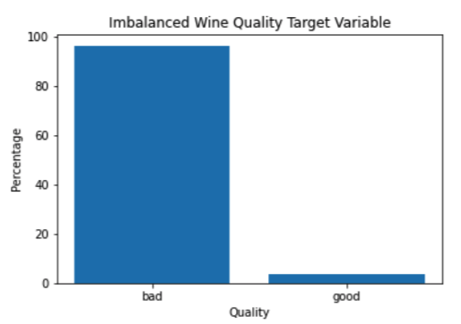
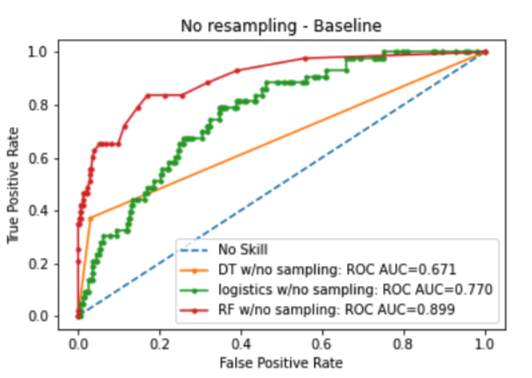
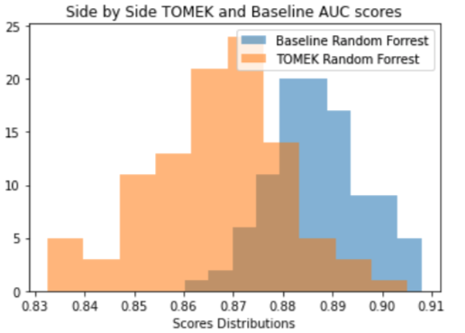
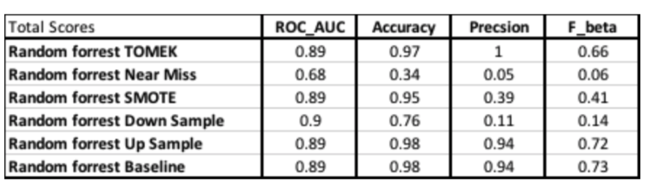

# classify-minority-class
To experiment with highly skewed (artificially created categorization) data
<b>Table of Contents:</b>
<b>The Dataset:</b>
<b>Classifiers</b>
<b>Metrics to compare the Classifiers</b>
<b>Results </b>
<b>Conclusion: </b>

<b>Introduction:</b>
To experiment with highly skewed (artificially created categorization) data, data that is imbalanced and see if its possible to classify the minority class accurately using many metrics. This is an experiment to explore if classifiers can separate accurately based on the minority class and the focus is on the sampling methods. To explore If any of the sampling methods can increase or decrease the performance of the classifiers is the goal of this experiment.

<b>The Dataset:</b>
Looking to test if different sampling methods help the algorithm differentiate between classes is the goal of the report. So I have decided to choose a simple data set that has a ordinal target. The wine dataset (UCI white wine) target represents the quality of the wine, with lower values as bad wine starting from 3 and best quality wines as 9. I have decided to transform the target variable to categorical vector. Anything below 8 is bad wine and 8 and above are good wines. This transformation will help in creating a highly imbalanced data set. Also I have decided to choose the precision or the False Positive ratio as the direction to reduce.
This means from the perspective of the confusion matrix, I will try to use different sampling methods to try to achieve a higher precision score. Where I am more sure about classifying Good wines than Bad wines. This may be a challenge to achieve because classifiers are built to maximize accuracy based on balanced data, that means most classifier are assuming same distribution for both the train and test sets.
Challenging these assumption is the goal of this report. Will try to test these assumption and see if its possible to use sampling methods to classify accurately an highly imbalanced dataset.

<b>Classifiers</b>
I have chosen three classifier that are simple so the focus can be placed in the sampling methods and the imbalanced data set. Three different classification algorithms are applied to the dataset to find the best model that produces the best results. In this section, brief overviews of the utilized models as well as preliminary results are presented. A more in-depth discussion about the results as well as the comparison between the sampling methods is presented in the following section.
The classifier have been fitted with their defaults parameters and no hyper parameters have been tested. The idea here is to keep the focus on the score metrics and the iteration over different sampling methods.
The Classifier are:
1. Decision Trees
2. Logistics Regression 3. Random Forest
The Sampling Methods to be tested:
1. Up Sampling
2. Down Sampling 3. SMOTE
4. Near Miss
5. TOMEK

<b> Metrics to compare the Classifiers</b>
I will use the below metrics to compare the 3 classifiers with the baseline of no sampling and the remaining 5 different sampling methods. The baseline should provide the comparison between sampling and not sampling when using the mentioned classifiers. The metrics to be used to measure the comparison are below.
To test the classifiers on the imbalanced data set, I will capture the following metrics: 1. ROC_AUC score
2. Accuracy score
3. Precision Score
4. F_beta score

<b>Results</b>

After testing all the above methods, TOMEK sampling seems to produce the best results.

Significance testing for TOMEK and the Baseline:
I will conduct a z test to see if there is a significant difference between the TOMEK and the Baseline for the AUC test scores.

<b>Conclusion: </b>
After testing the five different methods of sampling and seeing if there is any difference between the baseline and sampling methods, they is not enough evidence to support that sampling plays a role in the three classifier used. Random Forest continued to perform well with the default setting and no hyper tuning (see table 7), but also the sampling methods where not hyper tuned and used the default setting only. Both the Baseline and TOMEK for the Random Forest classifier performed well with the unbalanced data set. But the remaining classifier had mixed performance and mostly achieved bad results. It is safe to say that the Random Forest achieved good separations with out any sampling.
F_beta score:
The F beta score is the score that is indicative of a classifier achieving good separation. Most sampling methods achieved badly except for Up sampling and TOMEK and only for the Random Forest Classifier.
Z-test for AUC on Random Forest:
We did obtain a close to zero p-value for a z test on AUC scores between the Baseline and the TOMEK, which suggest a difference in means. Also suggest that we should be using TOMEK sampling when applicable. But more testing is needed regarding the settings of each sampling method, because these have not been test yet.
I think we can safely say that Random Forest is robust in tackling extreme unbalanced data with out any sampling needed for similar datasets, but adding the TOMEK sampling is best practice if it does not affect computational power.

